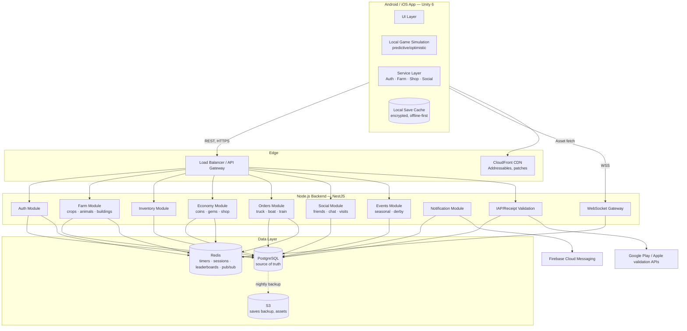
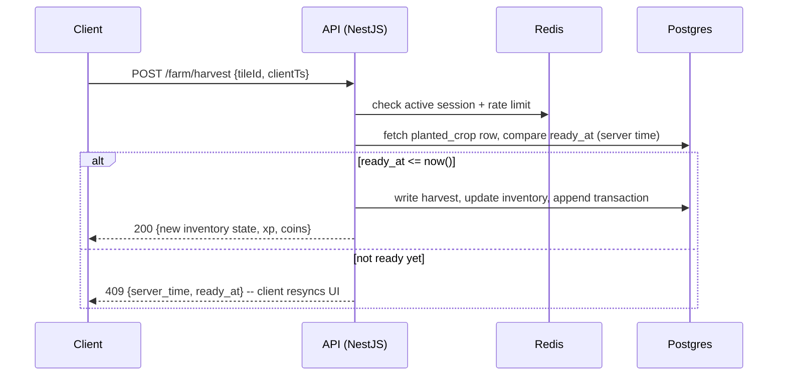

# Harvesto — Game Design & Technical Plan

> A Hay Day–caliber mobile farming simulation. This document is the single source of truth for vision, systems, architecture, data model, and delivery roadmap.

---

## 1. Vision & Pillars

**One-line pitch:** A cozy, endlessly replayable farm you grow from a dusty plot into a bustling town — plant, raise, craft, trade, and deliver your way to prosperity.

**Design pillars** (every feature decision gets checked against these):

1. **Always something to do, nothing that punishes you for leaving.** Timers range from seconds to hours, never days early on. No energy/stamina system that blocks play.
2. **Short loop, long arc.** A single plant→harvest→sell action takes seconds; mastering the farm takes months.
3. **Friction sells convenience, not power.** Diamonds skip time or unlock cosmetics/space — they never buy a competitive edge you can't out-play by waiting.
4. **Social by ambient presence, not obligation.** Neighbors, roadside shop visits, and gifting create warmth without forcing sync play.
5. **Legible economy.** Every currency and resource has one clear purpose (see §7). Players should always know *why* they need something.

**Target platform:** Android + iOS (phones and tablets), portrait orientation, free-to-play with IAP.

---

## 2. Tech Stack

| Layer | Choice | Notes |
|---|---|---|
| Client engine | **Unity 6 (2D)**, C#, URP | Best mobile 2D tooling, Addressables for asset streaming, DOTS optional later for large farms |
| Client architecture | MVVM-ish with a thin **Service Layer** talking to backend; UI Toolkit or uGUI (uGUI recommended for mobile perf maturity) | See §9 |
| Backend | **Node.js** — **NestJS** (not raw Express) | NestJS gives DI, module boundaries, and testability that map 1:1 to the systems below; Express under the hood via `@nestjs/platform-express` |
| API style | REST for CRUD/transactional actions, **WebSockets** (Socket.IO or native `ws` via NestJS gateways) for presence, chat, neighbor visits, live derby leaderboards | REST stays authoritative; WS is for push, never for state mutation |
| Primary DB | **PostgreSQL** | Player profiles, farms, inventory, transactions, social graph |
| Cache / ephemeral | **Redis** | Session tokens, active timers, rate limiting, leaderboard sorted sets, pub/sub for WS fan-out across server instances |
| Cloud | AWS (assumed default — see §11) | ECS/Fargate or EKS for API, RDS for Postgres, ElastiCache for Redis, S3 for assets, CloudFront CDN |
| Storage | S3 (player save blobs/backups, Unity Addressables remote bundles, UGC if any) | |
| Auth | Google Play Games, Apple Sign-In, Guest (device-bound), Email/password | Server issues its own JWT + refresh token after federated verification — see §6.1 |
| Payments | Google Play Billing, Apple IAP | Server-side receipt validation is mandatory — never trust client-reported purchases |
| Analytics | Firebase Analytics, Crashlytics | Supplement with a lightweight internal events pipeline (Postgres/BigQuery) for economy tuning — Firebase alone won't answer "is the sugar mill under-used" |
| Push notifications | Firebase Cloud Messaging (FCM) | Covers both Android and iOS (APNs via FCM) |
| CI/CD | GitHub Actions + Unity Cloud Build (or self-hosted Unity build runners) for client; GitHub Actions → Docker → ECS for backend | |

**Why NestJS over plain Express:** a farming sim's backend is really ~10 bounded-context modules (auth, farm, economy, orders, social...). NestJS's module/provider system keeps those boundaries enforced by the compiler instead of by convention, which matters once more than 2 engineers touch the backend.

---

## 3. High-Level Architecture



**Server-authoritative rule:** the client simulates optimistically for responsiveness (a planted crop shows growing immediately), but every timer, harvest, and transaction is re-validated against server timestamps on sync. This is the #1 anti-cheat measure and non-negotiable — see §10.

---

## 4. Core Game Loop

```
Plant crop → wait → Harvest → feed to animals / sell / craft in building
   → fulfill Truck/Boat/Neighbor orders → earn Coins + XP
   → spend Coins on expansion, buildings, decorations
   → level up → unlock new crops/animals/buildings/recipes
   → repeat at larger scale, richer variety
```

Layered on top: **daily loop** (login bonus, daily missions, roadside shop restock, mail/gifts) and **weekly loop** (derby league, limited-time event, boat/train big orders).

---

## 5. Farm Grid & World Structure

- **Farm plot**: tile-based grid (Hay Day uses ~roughly 20×20 growable to 30×30+; we mirror this — start at a fixed core grid, e.g. 16×16, with fog/locked tiles around it).
- **Expansion**: locked tiles cleared with **Tools** (axe for trees/bushes, shovel for rocks, saw for stumps) crafted at a **Toolbox** or bought with coins/diamonds. Each clear costs coins + a wait timer (or diamonds to skip).
- **Zones**: Farm (crops/animals/buildings), **Town** (unlockable at a level gate — place shops staffed by townsfolk to unlock new recipes/goods), **Fishing Lake** (separate mid-game unlock), **Derby/Valley** (event-only area, Phase 4).
- **Placement rules**: buildings/decorations snap to grid, collision-checked server-side on save to prevent overlap exploits.

---

## 6. Systems Breakdown

### 6.1 Login, Profile & Auth
- Federated login: Google Play Games, Apple Sign-In, Email/password, or **Guest** (device-id bound, upgradeable later to a real account — critical for retention since most first sessions are guest).
- Backend issues short-lived **JWT access token** + long-lived **refresh token** (Redis-backed, revocable) after verifying the federated identity server-side.
- Account linking: a Guest account must be linkable to Google/Apple/Email without losing progress (merge-safe — reject double-link with a clear conflict-resolution prompt, never silently overwrite).
- Profile: username, avatar/farmer skin, level, farm name, bio, join date, achievement showcase.

### 6.2 Crop Planting & Harvesting
- Crops occupy a field tile, have `growTimeSeconds`, `unlockLevel`, `sellPriceCoins`, `xpOnHarvest`, `seedCost`.
- Progression example (mirrors Hay Day's pacing):

| Crop | Unlock Lvl | Grow Time | Sell (coins) |
|---|---|---|---|
| Wheat | 1 | 20s | 2 |
| Corn | 2 | 3 min | 4 |
| Soybean | 4 | 20 min | 8 |
| Carrot | 6 | 40 min | 12 |
| Indigo | 9 | 2 hr | 22 |
| Sugarcane | 12 | 4 hr | 32 |
| Cotton | 15 | 6 hr | 45 |

- Multi-tile planting (tap-drag to plant/harvest a whole row) is a QoL must-have from day one.
- Harvested crops go to the **Silo** (capacity-limited, upgradeable).

### 6.3 Animal Care
- Animals live in dedicated buildings/pens (Coop, Barn Pen, Pig Pen, Sheep Pen, etc.), each with an animal-count capacity.
- Loop: **Feed** (consumes crop-based feed, e.g. Wheat for chickens once unlocked, dedicated Feed for others) → wait → **Collect** product (egg, milk, wool, etc.).
- Animal products go to the **Barn** (separate capacity pool from Silo — crops vs. goods).
- Buying animals costs coins and consumes a livestock trailer/space; each animal has a happiness/product-quality flourish (cosmetic, no punishing mechanic).

### 6.4 Production Buildings ("Factories")
- Each building converts raw goods (crops/animal products) into higher-value goods via **recipes**: input list, output good, craft time, unlock level.
- Examples: Bakery (bread, cake), Dairy (butter, cheese), Feed Mill, Sugar Mill, Cotton Loom → Sewing Machine (fabric → clothes), Juice Press, Popcorn Pot, BBQ Grill, Smokehouse, Ice Cream Maker.
- Buildings have a **queue** (1 slot at low level, expandable) so players can queue several crafts.
- New recipes unlock by **level** and/or by **staffing the matching shop in Town** (ties Town system into production progression).

### 6.5 Storage: Silo & Barn
- **Silo**: crop storage, starts small (e.g. 20), upgradable with coins (cost curve scales) up to a soft cap, then diamonds/level-gated beyond.
- **Barn**: everything else (animal goods, factory goods, tools, decorations-in-inventory).
- Storage-full is a soft blocker (can't harvest until space frees) — deliberately creates urgency to sell/use goods, core to Hay Day's pacing, but never blocks indefinitely (always sellable or usable).

### 6.6 Marketplace / Roadside Shop
- **Roadside Shop**: player lists goods with a price (bounded min/max per item to prevent economy abuse); other players (mainly neighbors/visitors) can buy while browsing the farm, even when the owner is offline. Owner collects coins asynchronously (mailbox notification).
- **Newspaper / Classifieds** (Phase 3+): global-ish listings board where players advertise roadside shop items to non-neighbors for a small fee, driving cross-player commerce.

### 6.7 Economy: Coins & Diamonds
- **Coins**: primary currency, earned via selling/orders, spent on seeds, feed, expansions, buildings.
- **Diamonds (premium/gems)**: earned slowly via achievements/level-ups/events, purchased via IAP; spent on time-skips, expansion, cosmetic exclusives, extra storage/building slots. **Never** the only way to obtain a gameplay-blocking item — everything diamond-priced must have a coin/time alternative *or* be purely cosmetic.
- Full sink/source ledger tracked server-side per player for economy tuning (see §8, `transactions` table).

### 6.8 XP & Leveling
- XP earned from harvesting, feeding, crafting, completing orders, expanding.
- Level curve: front-loaded (fast levels 1–10 to hook players), flattening into a longer tail (Hay Day-style, effectively no hard cap — very high level ceiling e.g. 1–300+, with content unlocks concentrated in the first ~60).
- Each level unlocks a curated *thing* (crop, animal, building, recipe, or expansion) — never an empty level.

### 6.9 Achievements
- Category-based (Farming, Livestock, Production, Trading, Social, Exploration), tiered (bronze/silver/gold/★), rewarding coins/diamonds/XP and a profile badge.

### 6.10 Daily Rewards & Missions
- **Daily login streak** with escalating rewards (reset-safe: a missed day drops streak but doesn't zero long-term rewards harshly — avoid punishing lapsed players too hard, it kills reactivation).
- **Daily/rotating missions** ("Harvest 10 Corn", "Fulfill 3 truck orders") — bite-sized, always at least one active.
- **Mailbox**: gifts from neighbors, roadside-shop sale proceeds, event rewards, customer-support compensation — all delivered async via mail, not full push interruptions.

### 6.11 Orders: Truck, Boat, Train
- **Truck**: always-available local orders (2–3 slots), short fulfillment, coin + XP reward — the bread-and-butter loop.
- **Boat**: unlocked ~level 5–8, bigger multi-item orders, longer timer, better rewards (coins + diamonds chance), arrives/departs on a cycle.
- **Train** (Phase 4 stretch): late-game, large multi-good orders, possibly cooperative (multiple neighbors contribute) — biggest reward tier.
- Order pool generated server-side (weighted by player level/unlocks) so it can be tuned without a client release.

### 6.12 Friends, Social & Chat
- Friends list, farm visits (view + help: water/harvest-assist actions that don't take the friend's resources, purely goodwill), gifting (send/receive consumables via mailbox).
- **Neighborhoods** (Phase 3+): small persistent groups (e.g. 30 players) — shared chat channel, group missions, and the basis for the Derby league.
- Chat: neighborhood + optional global "town square" channel, profanity-filtered, rate-limited, reportable (moderation hooks — see §10).

### 6.13 Seasonal Events
- Time-boxed (1–3 week) content: themed decorations, a limited crop/recipe chain, an event-currency track with a reward ladder (battle-pass-adjacent but no paid gate required for full track — a paid track can *accelerate*, not gate, per pillar #3).
- Driven entirely by server-side config (start/end date, reward table) so no client build is needed to launch/end an event.

### 6.14 Decorations & Farm Customization
- Purely cosmetic placeables (fences, paths, trees, statues) bought with coins/diamonds/event currency; some grant a small passive "farm value" or visitor-appeal stat feeding into a light social-flex mechanic (Hay Day's "Farm Level"/visual richness), never a gameplay-power stat.

### 6.15 Character Customization
- Farmer avatar: skin tone, outfit, hat/accessory — cosmetic-only, sold in shop or event rewards.

### 6.16 Cloud Save
- Postgres is the source of truth; local save is a write-through cache for offline play (see §9.4) that reconciles on reconnect using server-authoritative timestamps.
- Manual "restore progress" flow tied to the account (Google/Apple/Email) for device switches.

### 6.17 Push Notifications
- FCM-driven, sparse and consented: "crop ready," "order about to expire," "friend gifted you something," "event ending soon." Configurable per-category opt-out in settings — over-notifying is a top uninstall driver in this genre.

### 6.18 In-App Purchases
- Diamond bundles, starter packs, seasonal-event passes, occasional "producer packs" (coins+diamonds+time-skip bundle). All purchases validated server-side against Google/Apple before granting (see §10.2).

### 6.19 Advertising (optional, off by default at launch)
- Rewarded-video only (never forced interstitials) — e.g. "watch an ad to instantly finish this craft" or bonus coins. Kept strictly opt-in per pillar #1 (never punishes for leaving/not watching).

---

## 7. Currency & Resource Summary

| Resource | Earned via | Spent on | Notes |
|---|---|---|---|
| Coins | Selling crops/goods, orders, roadside shop | Seeds, feed, buildings, expansion, coin-priced decorations | Primary loop currency |
| Diamonds | Level-ups, achievements, events, IAP | Time-skips, expansions, exclusive cosmetics, extra slots | Never gameplay-blocking |
| XP | Nearly every action | Auto-spent on leveling | Drives unlock cadence |
| Event Currency | Event-specific tasks | Event reward ladder | Expires/converts at event end |
| Crops / Goods / Feed / Tools | Farming loop | Recipes, orders, feeding, expansion | Physical inventory, capacity-limited |

---

## 8. Data Model (PostgreSQL — core tables)

```
users
  id (uuid, pk), auth_provider, provider_id, email (nullable),
  username, created_at, last_login_at, banned_at (nullable)

player_profiles
  user_id (fk), level, xp, coins, diamonds, farm_name,
  avatar_config (jsonb), tutorial_stage

farms
  id (pk), user_id (fk), grid_width, grid_height, expansion_state (jsonb)

farm_tiles
  id (pk), farm_id (fk), x, y, tile_type, entity_id (nullable fk → planted_crops/buildings)

planted_crops
  id (pk), farm_id (fk), tile_id (fk), crop_type_id,
  planted_at (timestamptz), ready_at (timestamptz), harvested_at (nullable)

buildings
  id (pk), farm_id (fk), tile_id (fk), building_type_id, level

building_queue
  id (pk), building_id (fk), recipe_id, started_at, ready_at, collected_at (nullable)

animals
  id (pk), farm_id (fk), pen_building_id (fk), animal_type_id,
  fed_at (nullable), product_ready_at (nullable), collected_at (nullable)

inventory_items
  id (pk), user_id (fk), item_type_id, quantity, storage_pool (enum: silo|barn)

orders
  id (pk), order_source (enum: truck|boat|train), requirements (jsonb),
  reward (jsonb), expires_at, assigned_farm_id (nullable), fulfilled_at (nullable)

transactions
  id (pk), user_id (fk), currency (enum: coins|diamonds), delta,
  reason (enum: sell|purchase|order_reward|iap|...), created_at
  -- append-only ledger, source of truth for economy analytics & disputes

roadside_shop_listings
  id (pk), farm_id (fk), item_type_id, quantity, price_coins, listed_at

social_friends
  user_id (fk), friend_id (fk), status (pending|accepted), created_at

neighborhoods
  id (pk), name, created_at
neighborhood_members
  neighborhood_id (fk), user_id (fk), role (member|leader), joined_at

achievements / user_achievements
  standard def + unlock table

iap_receipts
  id (pk), user_id (fk), store (google|apple), receipt_token,
  product_id, verified_at, granted (bool)

events / event_progress
  server-config-driven event defs + per-user progress
```

**Redis usage:** active session tokens, refresh-token blocklist, per-farm "next timer expiry" cache for cheap polling, rate-limit buckets (per-action abuse prevention), derby leaderboard sorted sets, WS pub/sub channel for cross-instance fan-out (friend online, roadside purchase pings, chat).

---

## 9. Client Architecture (Unity)

### 9.1 Project Structure

```
Assets/
  _Project/
    Scripts/
      Core/              # bootstrap, DI (VContainer or Zenject), app state machine
      Services/          # AuthService, FarmService, EconomyService, SocialService...
                          # each wraps REST/WS calls, owns local caching
      Domain/             # plain C# models mirroring server DTOs (Crop, Building, Order...)
      Simulation/          # local optimistic-update logic (timers, grid rules)
      UI/                  # per-screen controllers + view-models
      Persistence/         # local encrypted save, offline queue of pending actions
      Networking/          # HTTP client wrapper, WS client, retry/backoff, auth interceptor
    Prefabs/
    Art/ (URP materials, sprites, atlases)
    Addressables/          # remote-updatable content (events, seasonal art)
    Audio/
    Scenes/
```

### 9.2 Key architectural choices
- **Server-authoritative timers, client-predicted display**: client shows a countdown computed from `ready_at` (server timestamp), never trusts a local timer alone — resyncs on foreground/reconnect.
- **Offline-first with action queue**: actions taken while offline (plant, harvest, feed) queue locally and replay against the server on reconnect; server validates each against current state and rejects/reconciles impossible ones (e.g., a crop already expired) with a clear client-side diff rather than silent failure.
- **Addressables for live content**: seasonal art/event config ship via CDN-hosted asset bundles so events don't require an app-store review cycle for art (config already server-driven per §6.13).
- **DI container** (VContainer recommended — lighter than Zenject, good IL2CPP/mobile perf) to keep services testable and swappable (e.g., mock backend in editor).

### 9.3 Rendering / performance targets
- URP 2D renderer, sprite atlasing, aggressive draw-call batching (large farm grids are the main perf risk) — budget: mid-tier Android device (e.g., 3-year-old mid-range) sustains 60fps with a fully built-out farm.
- Object pooling for tile entities, crop growth-stage sprite swapping instead of per-tile animators where possible.

### 9.4 Save/reconcile flow



---

## 10. Security, Anti-Cheat & Trust

1. **Server-authoritative everything that affects currency, XP, or inventory.** Client is a renderer + predictor, never the source of truth.
2. **Receipt validation server-side** for all IAP before granting diamonds (Google Play Developer API / App Store Server API) — reconcile with a webhook where available (RTDN / App Store Server Notifications) to catch refunds/chargebacks and revoke if needed.
3. **Rate limiting** per user per action type (Redis token bucket) to blunt scripted farming bots.
4. **Anomaly monitoring**: a lightweight backend job flags accounts with impossible earn rates for manual/automated review — feeds a ban/soft-ban pipeline (`users.banned_at`).
5. **Chat moderation**: profanity filter + report queue + rate limits; neighborhood/friend scoping limits blast radius of abuse.
6. **Transport security**: TLS everywhere, JWT short expiry + refresh rotation, refresh-token revocation list in Redis for logout/compromise.

---

## 11. Cloud & DevOps

- **AWS** (recommended default given the stack's Node/Postgres/Redis shape and mature managed services):
  - ECS Fargate (or EKS if the team already runs k8s) for the NestJS API, autoscaled on CPU/connection count.
  - RDS for PostgreSQL (multi-AZ once live), read replica for analytics queries so they never contend with gameplay traffic.
  - ElastiCache for Redis (cluster mode for the WS pub/sub + leaderboard load once concurrency grows).
  - S3 + CloudFront for Addressables/asset delivery and nightly DB backups.
  - Secrets Manager for IAP keys/DB creds; never in repo or client.
- **Environments**: `dev` → `staging` (QA, mirrors prod config, seeded economy for balance testing) → `prod`. Feature flags (simple server-side config table or LaunchDarkly-style tool) gate new systems per-environment.
- **CI/CD**: GitHub Actions runs backend tests/lint/build → Docker image → deploy to ECS on merge to `main` (staging) / tag (prod). Unity Cloud Build (or self-hosted build agents) produces Android/iOS builds on tag, uploads to Play Console internal track / TestFlight automatically.
- **Observability**: structured logs → CloudWatch (or ELK), NestJS request tracing, Redis/Postgres metrics dashboards, alerting on error-rate and IAP-validation failure spikes specifically (revenue-critical path).

---

## 12. Roadmap

### Phase 1 — Core Loop (MVP)
*Goal: a farm that's fun to poke at for 15 minutes a day, fully cloud-saved.*
**Status: done** — backend (`server/`) and a real Unity 6 URP client (`client/`) both built and verified live against each other; see their READMEs for setup and known limitations (no offline action queue yet, placeholder art).
- Auth (guest + one federated provider to start), profile creation.
- Farm grid, plant/harvest crops (5–6 crop types), Silo storage.
- Coins economy, basic selling, XP + leveling (first ~15 levels of content).
- Server-authoritative timers, offline action queue, cloud save/reconcile.
- Minimal UI: farm view, inventory, shop for seeds.
- Backend: Auth, Farm, Inventory, Economy modules; Postgres schema for the above; Redis session/timer cache.

### Phase 2 — Production Economy
*Goal: the game becomes a system, not just a clicker.*
**Status: backend done for everything except IAP/push** (Animals, Buildings/Recipes, Barn storage, Truck orders, Achievements, daily login streak, daily missions, mailbox — see `server/README.md`), all verified live end-to-end. Client (`client/README.md`) has a Unity UI (placeholder art/layout) for animals/buildings/orders; achievements/daily-login/missions/mailbox are backend-only so far — no client UI yet. **Not yet started:** expansion/tools system, IAP receipt validation, push notifications (the latter two need real Google Play/Apple/Firebase credentials this environment doesn't have).
- Animals (2–3 species) + pens, Barn storage.
- Production buildings + recipes (3–4 buildings).
- Truck orders. Achievements. Daily missions + login rewards + mailbox.
- Expansion system (tools, locked tiles).
- IAP integration (diamonds, receipt validation), rewarded-video hook (flagged off by default).
- Push notifications (crop-ready, order-expiring).

### Phase 3 — Social & Trading
*Goal: turn a single-player toy into a game people check because others are in it.*
**Status: core backend + client done** (Friends — request/accept/decline/remove, read-only farm visits, Help/Gift once per friend per UTC day via mailbox, Boat orders — see `server/README.md` and `client/README.md`), verified live with a multi-account backend test plus a headless client Play-mode run. Client friend-adding needs a raw pasted user id (no search/friend-code yet); viewing a friend's farm just logs a summary rather than rendering their grid. **Not started:** Roadside Shop + Newspaper/classifieds, Neighborhoods + chat (the WebSocket layer §2/§3 calls for still doesn't exist — nothing beyond REST is built yet), seasonal event framework, analytics-driven economy tuning pass.
- Friends, farm visits, gifting/mailbox expansion.
- Roadside Shop + Newspaper/classifieds.
- Neighborhoods, chat.
- Boat orders. Seasonal event framework (server-config-driven) + first live event.
- Analytics-driven economy tuning pass using the `transactions` ledger.

### Phase 4 — Depth & Live-Ops Maturity
*Goal: long-tail retention systems.*
**Status: Fishing Lake, Train orders, character customization, and decorations/farm-value all done, backend + client** (see `server/README.md` and `client/README.md`), verified live end to end including a headless client Play-mode run. **Blocked/not started:** Town system, Derby league (needs Neighborhoods from Phase 3 plus a working Redis — this dev environment only has Postgres running), seasonal content cadence, A/B testing, expanded anti-cheat. Note: achievements/daily-login/missions/mailbox (Phase 2 systems) are still backend-only — no client UI for those yet.
- Fishing Lake mini-loop, Town system (staffed shops unlocking recipes), Train orders.
- Derby league (weekly competitive event within neighborhoods, leaderboards via Redis sorted sets).
- Character customization expansion, decoration depth, farm-value/visitor-appeal flex stat.
- Ongoing seasonal content cadence, A/B testing framework for economy/UX, expanded anti-cheat/anomaly detection.

*(Each phase should end with a staging soft-launch in at least one small market before the next phase's backend work begins — this is where the `dev/staging/prod` split in §11 earns its keep.)*

---

## 13. Open Decisions to Revisit

- Exact leveling/economy curve values (table above are seed estimates — need spreadsheet-based tuning pass before Phase 1 content lock).
- uGUI vs UI Toolkit for the client UI layer (recommend uGUI for now given mobile perf maturity; revisit once UI Toolkit's mobile story matures further).
- Which cloud provider — this doc assumes AWS; GCP (Cloud Run + Cloud SQL + Memorystore) or Azure are equally workable if the team has existing credits/expertise there. Swap §11 accordingly if so.
- Whether ads ship at Phase 2 or are deferred entirely to post-launch based on early monetization data.
